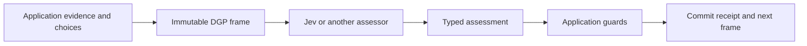

# DGP — Decision Graph Protocol for decision-based AI agents

[](LICENSE)
[](https://github.com/numerous-com/dgp/actions/workflows/validate.yml)

**Decision Graph Protocol (DGP)** is an open-source protocol by **Numerous** for
building decision-based AI agents. Applications expose evidence, typed decisions,
and guarded actions; an agent assesses the choices while application code retains
control of permissions and effects.

DGP is designed for **Jev-first orchestration** using [TypeSafe AI's Jev decision
model](https://docs.typesafe.ai/introduction), with bounded LLM assistance when
text or analysis is needed. Its core is assessor-neutral: deterministic resolvers,
other models, and humans can use the same decision contracts. This is an
independent Numerous project, not an official TypeSafe specification.

[Specification](SPECIFICATION.md) · [Quick start](#run-the-example) ·
[TypeSafe / Jev integration](docs/TYPESAFE_JEV.md) ·
[FAQ](docs/FAQ.md) · [Implementation status](docs/IMPLEMENTATION_STATUS.md) ·
[LLM documentation index](llms.txt)

## How decision-based agents use DGP

1. Read an immutable **frame** containing evidence and currently offered decisions.
2. Produce a typed **assessment**, using Jev or another eligible assessor.
3. Request a **commit**; the application checks current state and authorization.
4. Inspect the **receipt** and fetch the next frame.



Useful starting points include decision-driven coding tools, human-reviewed
workflows, and domain applications such as the specified Farm Energy Calculator.
DGP can expose part of an application alongside existing APIs, CLI tools, or UI.

## Release status

This source copy includes the optional [Jev harness profiles](profiles/jev-harness/PROFILE.md)
amendment: assessment batch registration and coding-tool contracts. These additions
are schema/examples/selected tests only, not ThreadDesk runtime features. Core 0.1
and its schemas remain unchanged. See [amendment validation](docs/HARNESS_AMENDMENT.md)
for actual checks and upstream provenance; historical validation below belongs to
the imported bundle, not a new execution claim.

**Finalized experimental protocol 0.1, consolidated into one self-contained source bundle.**

An application publishes rich evidence, current judgments, and schema-constrained inputs. An intelligent decision model operates that interface directly. A GUI can render the same contract. Jev is the intended first assessor; an optional LLM supplies text or diagnostic analysis when the workflow requests it.

**Start with [SPECIFICATION.md](SPECIFICATION.md).** DGP may expose only useful parts of an application, alongside UI, API, MCP, CLI, and optional GraphQL. The finalized spec covers semantics, trust boundaries, optional profiles, and primary-source references. The lead ordinary-app example is [Farm Energy Calculator](profiles/farm-energy/PROFILE.md); it is a specified design, not a running simulator. [docs/EXAMPLE_APP.md](docs/EXAMPLE_APP.md) walks through the application. [docs/IMPLEMENTATION_STATUS.md](docs/IMPLEMENTATION_STATUS.md) distinguishes implemented behavior from production work.

## What is included

| Component | Status |
|---|---|
| Protocol core and optional profiles | Finalized specification with schemas and examples. |
| ThreadDesk | Runnable local HTTP app, browser UI, controller CLI; simulated domain effects. |
| Farm Energy Calculator | Detailed application profile and synthetic wire/input examples; no simulator. |
| GraphQL, MCP, alternate native interfaces | Contracts/mappings; no runtime servers/adapters for these added profiles. |
| Validation | 106 Python tests (91 original + 15 harness-profile tests); see [current evidence](docs/HARNESS_AMENDMENT.md). |

The previous separate specification, ThreadDesk package, and calculator profile are consolidated here. No nested ZIPs or hidden dependencies on earlier downloads are needed to read the package. Python runtime dependencies still need installation to run code.

## Run the example

Python 3.11 or newer is the intended baseline. The package was exercised on Python 3.13.5. Its only third-party Python dependency is `jsonschema`. No frontend build or model API key is needed for the mock demonstration.

Clone the repository, then run the local mock demo with [uv](https://docs.astral.sh/uv/):

```bash
git clone https://github.com/numerous-com/dgp.git
cd dgp

DGP_AGENT_TOKEN=demo-agent-local \
DGP_HUMAN_TOKEN=demo-human-local \
uv run --no-project --with 'jsonschema==4.26.0' python -m dgp_demo.server
```

Open `http://127.0.0.1:8765`, paste `demo-human-local` into the token field, and select **Connect / refresh**. These deliberately obvious tokens are for this loopback demonstration only. Without explicit token environment variables, the server generates random tokens and prints them.

In another terminal, from the same repository directory, run:

```bash
DGP_AGENT_TOKEN=demo-agent-local \
uv run --no-project --with 'jsonschema==4.26.0' python -m dgp_demo.agent \
  --resolver mock --assistant mock \
  --parallel 2 --steps 6
```

Refresh the browser. The two fixtures reach different outcomes:

| Thread | Expected mock outcome |
|---|---|
| `thread-42` | Simulated retry → canned update draft → stops at human review. |
| `thread-73` | Requests diagnostic text → reads canned analysis → leaves work for investigation. |

The model's publication recommendation does not publish. An authenticated human must review the draft and select **Publish (human only)**. Publication writes to a **local database bulletin**, not an external service.

**Nothing in this demo runs Git, launches real tests, sends email, or controls hardware.** The mock resolver is deterministic fixture logic, not Jev. The mock assistant returns canned text, not LLM output.

To start with fresh state, run the server with another database filename, for example `--db another-demo.sqlite3`. The existing database preserves frames, state, assessments, receipts, and idempotency history across restarts.

## Use real Jev and optional LLM assistance

The live adapters are explicit opt-ins. They require your credentials, network access, and enabled provider models. They were tested against controlled response fixtures, **not live paid APIs**, during package creation.

For real Jev with the canned assistant:

```bash
export DGP_AGENT_TOKEN=demo-agent-local
export TYPESAFE_API_KEY='your-typesafe-api-key'
export JEV_MODEL='jev-1.13.0'
uv run --no-project --with 'jsonschema==4.26.0' python -m dgp_demo.agent --resolver jev --assistant mock --steps 6
```

For real Jev plus a real text-producing service:

```bash
export OPENAI_API_KEY='your-openai-api-key'
export OPENAI_MODEL='your-enabled-text-or-reasoning-model-id'
uv run --no-project --with 'jsonschema==4.26.0' python -m dgp_demo.agent --resolver jev --assistant openai --steps 6
```

Use fresh application state for a fresh run. The model may choose a different valid path from the mocks. No claim is made about decision quality, price, latency, or task success. Provider versions/capabilities can change; see the dated references in the specification.

The Jev adapter directly consumes text and structured state. The current adapter rejects required image evidence because the verified Jev API documents text-only input. The protocol and UI can still carry/display images. No automatic captioning is silently substituted.

The OpenAI service receives only text/JSON evidence and returns a brief analysis or draft; it receives no DGP credentials or application tools. Evidence may leave your machine in live mode. The included fixture data is synthetic; review data handling before connecting real logs or documents.

## Inspect or drive the protocol without the UI

```bash
curl -s http://127.0.0.1:8765/.well-known/dgp

curl -s -H 'Authorization: Bearer demo-agent-local' \
  'http://127.0.0.1:8765/dgp/surfaces/thread-42/frame?disclosure=full'
```

The [examples](examples) directory contains mutually consistent frame, assessment, commit, receipt, image, and graph records. Their IDs belong to the included transcript, not a newly started database. Always obtain fresh IDs when interacting with your running server.

Speculative assessment without commitment:

```bash
DGP_AGENT_TOKEN=demo-agent-local \
uv run --no-project --with 'jsonschema==4.26.0' python -m dgp_demo.agent --resolver mock --speculative --surface thread-42
```

This records a speculative judgment and stops. It does not branch the real world or run speculative tools.

## Tests

Run all included Python tests, schema/example audits, farm input cases, and JavaScript syntax checks:

```bash
uv run --no-project --with 'jsonschema==4.26.0' python tools/validate_bundle.py
```


```bash
uv run --no-project --with 'jsonschema==4.26.0' python -m unittest discover -s tests -v
```

The test suite covers schema validity, arbitrary text, images, stale/expired frames, changed policy, simultaneous conflicting commits, independent scopes, idempotent replay after restart, speculative rejection, authenticated human-only publication, derived evidence, provider request/response mappings, and complete mock HTTP flows.

`docs/TEST_RESULTS.txt` contains the test output from package validation. Provider tests use local fixtures. The browser renderer was separately exercised with in-memory protocol responses because this environment blocked browser navigation to loopback. The real HTTP flows were tested independently with the Python client; details are in the implementation-status document.

## Files

```text
SPECIFICATION.md              Finalized experimental 0.1 and source references
README.md                     Setup and operating instructions
AGENTS.md                     Handoff constraints and completion criteria
schemas/dgp.schema.json       Self-contained JSON Schema definitions
schemas/build_schema.py       Unchanged core schema generator
schemas/dgp.profiles.schema.json  Optional-profile schemas
profiles/farm-energy/          Ordinary calculator design and input examples
bindings/                     HTTP/MCP/CLI notes and optional GraphQL SDL
profile_support/              Selected executable contract checks
examples/                     Valid, mutually linked protocol fixtures
dgp_demo/                    Python application and client
web/                          Minimal browser interface; no build required
tests/                        Unit and local HTTP integration tests
docs/EXAMPLE_APP.md            Domain model and end-to-end walkthrough
docs/IMPLEMENTATION_STATUS.md  Coverage and explicit limitations
docs/TEST_RESULTS.txt          Captured validation output
```

## Important implementation boundaries

The app is loopback-only and single-tenant. It uses SQLite transactions for local state changes. Browser and agent use the same assessment and commit endpoints. The backend derives roles from separate bearer tokens; it never trusts a payload's claimed human/model identity.

The UI renders the choices and the demo's single-text-field inputs; it is not a complete arbitrary-JSON-Schema form generator. The binary upload checks a signature and size, not every possible malformed image. The shared schema includes rubric judgments, but this particular app only emits choice and input nodes.

The controller has bounded steps and per-process service calls. Production durable inference budgeting, multi-tenant authorization, external executors, distributed scheduling, subscriptions, and an actual MCP transport adapter are not included. DGP's MCP section is a mapping proposal, not a running MCP server.

## License and attribution

MIT License — Copyright (c) 2026 Numerous. See [LICENSE](LICENSE).
Third-party dependencies retain their own licenses. TypeSafe and Jev names refer
to their respective products; no endorsement is implied.

For attribution, use [CITATION.cff](CITATION.cff). Contributions should follow
[CONTRIBUTING.md](CONTRIBUTING.md).
